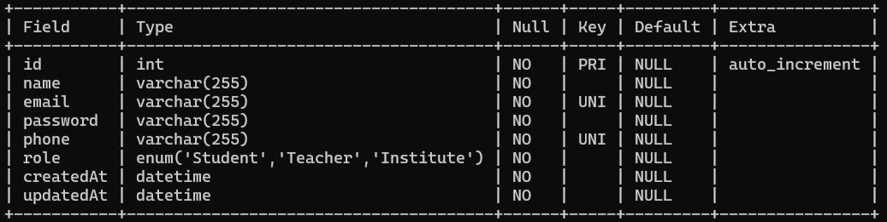
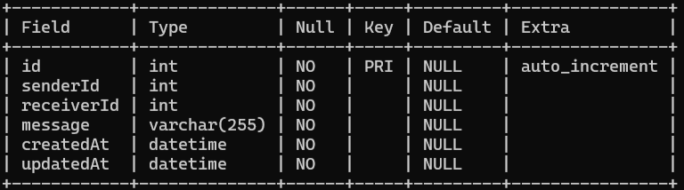

# Welcome to Chat-Application Backend

## Project setup
- Clone the project on your local.
- Execute `npm insall` on the same path as of your root directory of the clonned / downloaded project.
- Create a `.env` file in the root diretory and add the following environment variables.
    - `PORT = 3001`
- Inside the `src/config` folder create a new file `config.json` and then add the following piece of json
```
{
  "development": {
    "username": "<YOUR_DB_USERNAME>",
    "password": "<YOUR_BD_PASSWORD>",
    "database": "Flights_Search_DB",
    "host": "127.0.0.1",
    "dialect": "mysql"
  }
}
```
- Once you've added your db configuration as listed above, go to the src folder from your terminal and execute `npx sequelize db:create` and then execute `npx sequelize db:migrate`

## Database Design
  - User
  - Conversation

  - ### Associations
  - Between User and Conversations

## Tables 

### User -> id, name, email, phone, password, role, created_at, updated_at
  -  
### Conversation -> id, senderId, receiverId, message, created_at, updated_at
  - 
